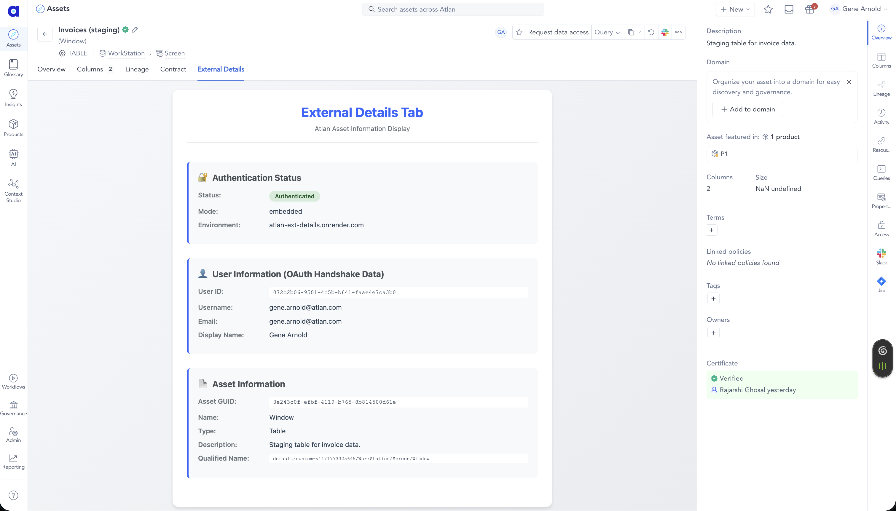
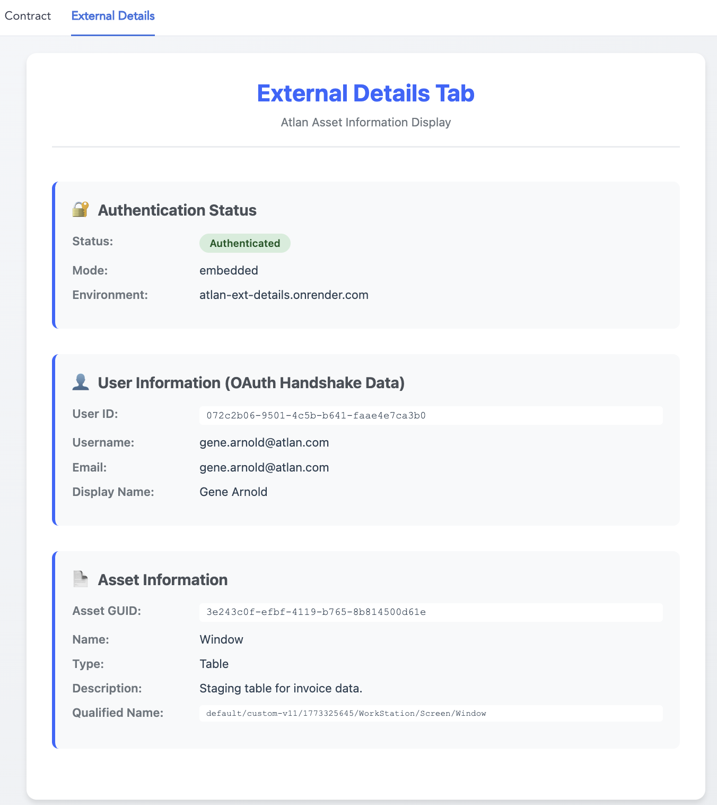

# Atlan External Details Tab

A clean, production-ready external tab for Atlan that demonstrates OAuth authentication, iframe communication, and REST API integration - reducing OAuth complexity from 200+ lines to just 10 lines of code.

## 🎬 See It In Action

**[Watch the Demo Video](https://www.loom.com/share/693ff4c1e30a470b8c344a914803c4b7)** - See the external tab working live in Atlan!

**Live URL:** https://atlan-ext-details.onrender.com
**Target Atlan:** https://fs3.atlan.com

### Screenshots

#### External Tab in Atlan Platform

*The External Details tab appears alongside native Atlan tabs like Overview, Columns, and Lineage*

#### Tab Content Display

*Clean display of authentication status, user information, and asset details including the description*

## 🎯 What This Does

This external tab integrates into Atlan's asset profile pages and successfully demonstrates all three key integrations:

✅ **OAuth Authentication** - User information from OAuth handshake displayed
✅ **PostMessage Communication** - Asset GUID captured from iframe context
✅ **REST API Integration** - Asset description retrieved and displayed

As shown in the screenshots above, the integration is working in production with real asset data!

## 🚀 Current Status

✅ **Deployed to Render** at https://atlan-ext-details.onrender.com
✅ **Working in Production** - Successfully integrated with Atlan at fs3.atlan.com

## 📦 Clean Project Structure

```
/
├── app.py                       # Flask application (serves frontend and API)
├── templates/
│   └── index.html              # Frontend with Atlan Auth SDK integration
├── requirements.txt            # Python dependencies
├── runtime.txt                # Python 3.11.10 (prevents compilation errors)
├── render.yaml                # Render.com configuration
├── Procfile                  # Gunicorn web server configuration
├── README.md                 # This file
├── TEACHING_GUIDE.md         # Step-by-step implementation guide
├── DEVELOPER_CHALLENGES.md  # Real-world challenges and solutions
├── IMPLEMENTATION_LEARNINGS.md # Technical discoveries and workarounds
└── archive/                  # Development/debug files (40+ files)
```

## 🔧 For Atlan Administrators

### Configuration Required

The app is deployed and running. To enable it in Atlan, add this configuration to the LaunchDarkly feature flag `external-iframe-tabs` for `fs3.atlan.com`:

```json
{
  "external-details-tab": {
    "display_name": "External Details",
    "iframe_url": "https://atlan-ext-details.onrender.com",
    "allowed_origins": [
      "https://atlan-ext-details.onrender.com",
      "https://*.onrender.com"
    ],
    "icon": "Analytics",
    "description": "Displays asset details with user authentication info",
    "render_at": [
      {
        "slot": "asset-profile-tab",
        "when": {
          "assetTypes": [
            "Table", "View", "MaterialisedView", "Column",
            "Database", "Schema", "AtlasGlossary",
            "AtlasGlossaryTerm", "AtlasGlossaryCategory", "Connection"
          ]
        }
      }
    ]
  }
}
```

### OAuth Setup Required

Register these redirect URIs in Keycloak:
- `https://atlan-ext-details.onrender.com`
- `https://atlan-ext-details.onrender.com/*`

## 🏗️ How It Works

1. **User clicks "External Details" tab** in any asset profile page in Atlan
2. **Atlan loads the app** in an iframe from Render
3. **Authentication happens automatically** via Atlan Auth SDK (OAuth 2.0 with PKCE)
4. **Asset GUID is captured** from raw postMessage before SDK processes it
5. **App displays**:
   - User details from OAuth token
   - Asset GUID from intercepted iframe message
   - Asset description via REST API with Bearer token

## 🔍 Testing the Deployment

### Health Check
```bash
curl https://atlan-ext-details.onrender.com/health
```

Expected: `{"status": "healthy", "service": "atlan-external-tab"}`

### After Configuration in Atlan
1. Navigate to any Table, Column, or Glossary term
2. Look for "External Details" tab
3. Click to see the information display

## ⚠️ Important Notes

### OAuth Requirements
- **Cannot test locally** - OAuth redirect URIs must be registered
- Must be deployed to public URL for authentication to work

### Python Version
- **Must use Python 3.11.10** (specified in `runtime.txt`)
- Newer versions cause pydantic compilation failures

### Render Deployment
- Free tier spins down after inactivity
- First request after idle takes ~30 seconds
- Logs available in Render dashboard

## 💡 Key Technical Achievements

### Simplified OAuth
- Reduced OAuth implementation from 200+ lines to just 10 lines using `@atlanhq/atlan-auth` SDK
- Handles both standalone and embedded modes automatically

### Asset GUID Capture Solution
- SDK strips page context in embedded mode
- Solution: Capture from raw postMessage BEFORE SDK initialization
```javascript
window.addEventListener('message', (event) => {
    if (event.data?.type === 'ATLAN_AUTH_CONTEXT') {
        assetGuid = event.data.payload?.page?.params?.id;
    }
});
```

### REST API vs SDK
- OAuth tokens don't work with pyatlan SDK (expects API keys)
- Solution: Use REST API directly with Bearer token authentication

### Documentation
For detailed implementation guidance, see:
- `TEACHING_GUIDE.md` - Complete step-by-step tutorial
- `DEVELOPER_CHALLENGES.md` - Real struggles and breakthroughs
- `IMPLEMENTATION_LEARNINGS.md` - Technical discoveries
- `archive/` - Contains 40+ development files for reference

## 🔄 Making Changes

1. Edit files locally
2. Push to GitHub: `git push`
3. Deploy on Render: "Manual Deploy" in dashboard
4. Test health endpoint

---

**Repository:** https://github.com/GeneArnold/atlan-ext-details
**Live App:** https://atlan-ext-details.onrender.com
**Target:** https://fs3.atlan.com